## 仓库介绍

这是笔者毕业设计项目（服装商城系统）的微信小程序版本客户端代码，后续计划开发出基于Vue和React版本的服装商城系统的客户端，链接地址如下：

-   [Vue版本的服装商城系统客户端](https://gitee.com/xkyong/clothing-mall-system-frontend-vue)
-   [React版本的服装商城系统客户端](https://gitee.com/xkyong/clothing-mall-system-frontend-react)

另外，要想看到该客户端的实际运行效果，是需要手动开启对应的后台服务的。如何开启后台服务详细见：

-   [基于Koa开发的服装商城系统服务端](https://gitee.com/xkyong/clothing-mall-system-backend)

## 项目运行效果截图

### 首页运行效果图

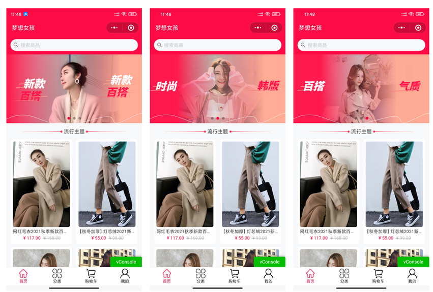

### 关键词搜索商品运行效果图

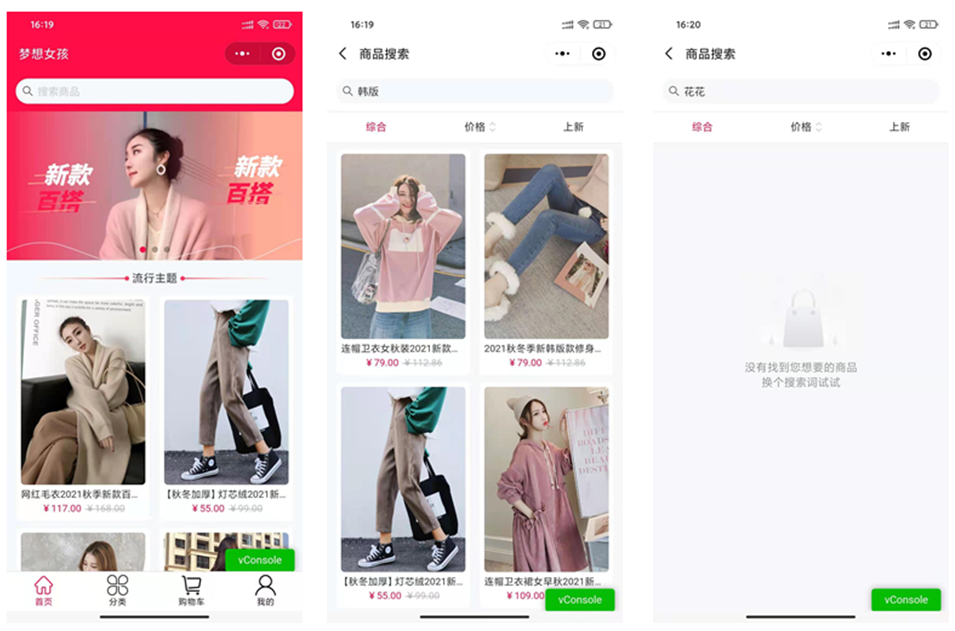

### 搜索历史搜索商品运行效果图

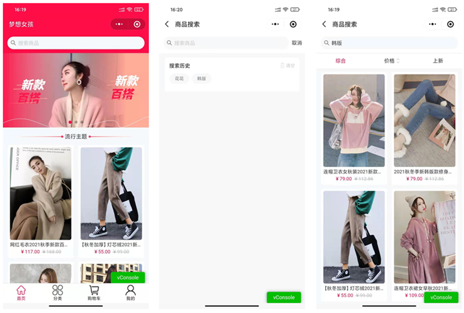

### 用户筛选搜索结果列表运行效果图

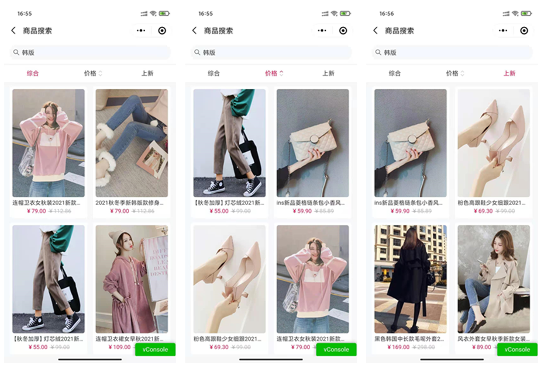

### 用户浏览分类类别运行效果图

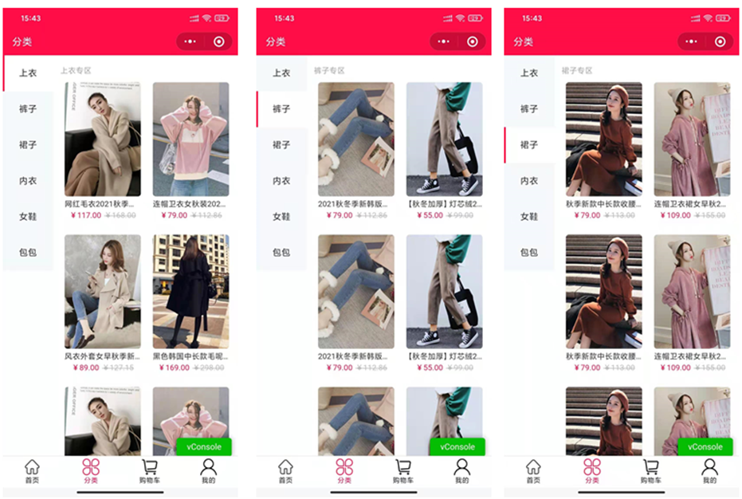

### 用户浏览分类商品列表运行效果图

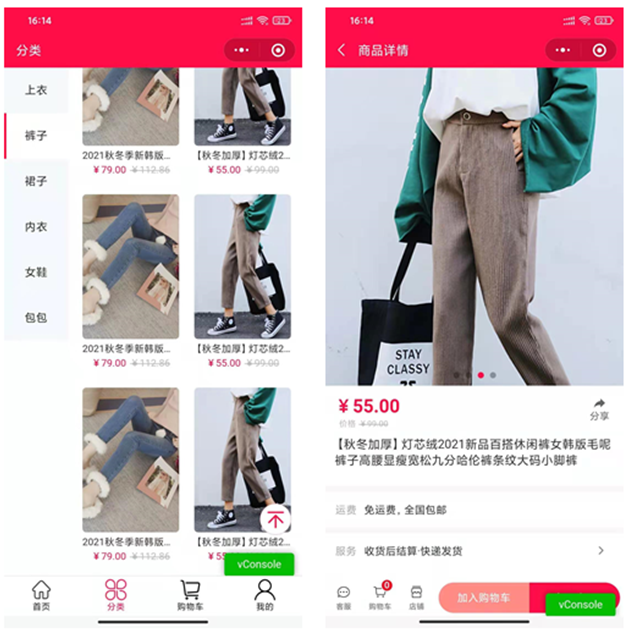

### 用户添加商品到购物车运行效果图

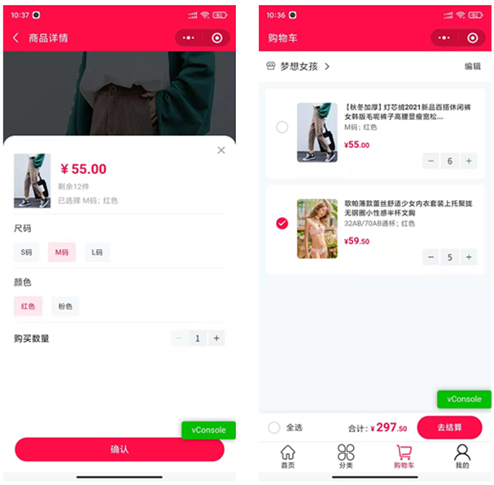

### 用户编辑购物车运行效果图

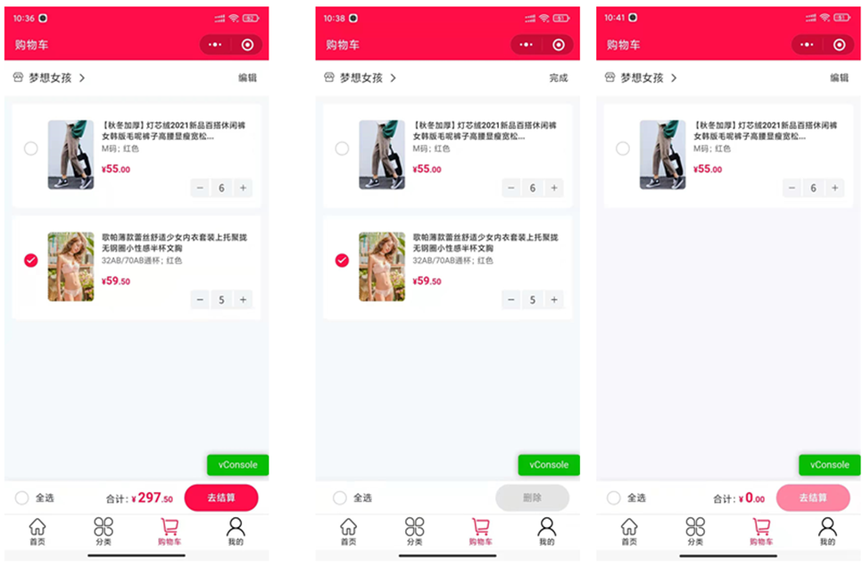

### 用户操作购物车商品运行效果图

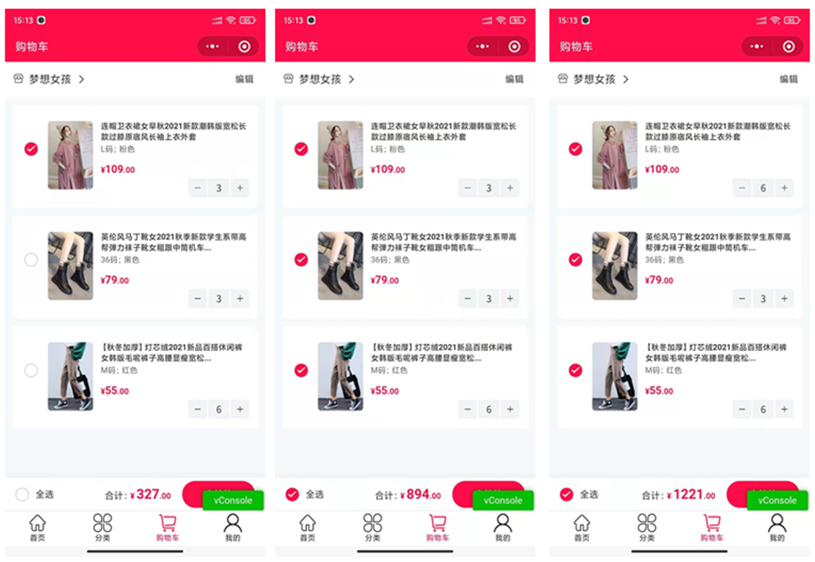

### 用户下单支付运行效果图

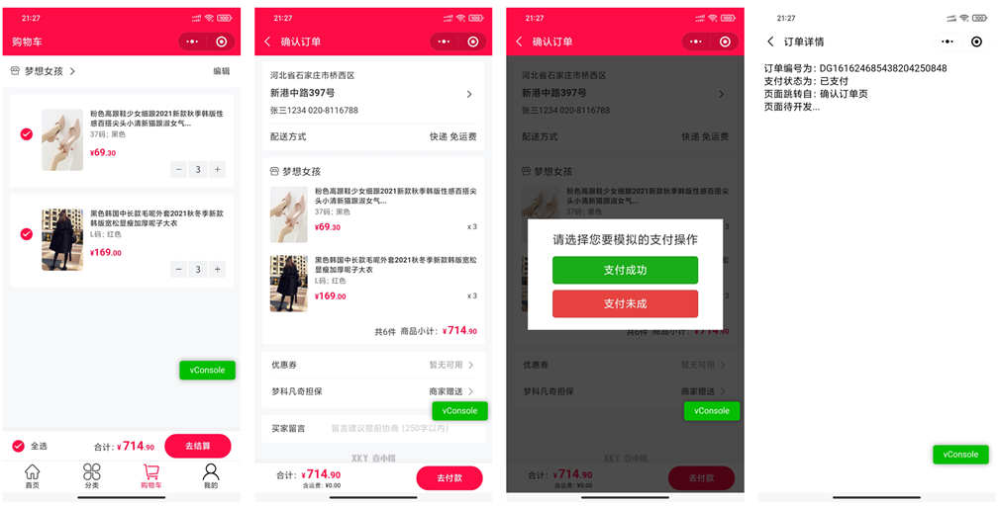

### 用户管理订单列表运行效果图

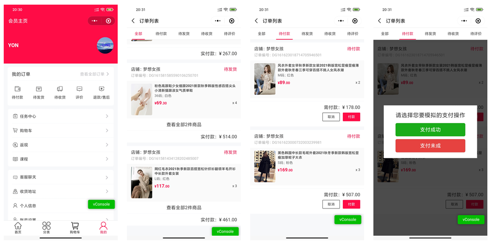

### 用户管理收货地址运行效果图

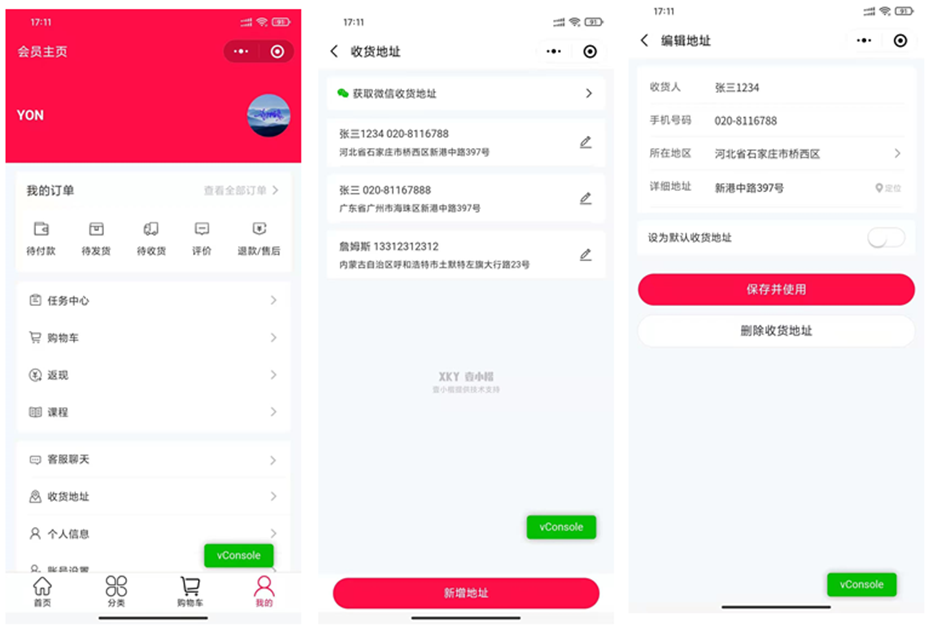

